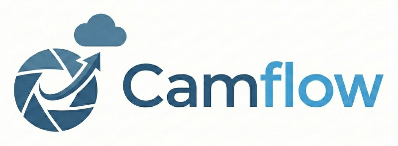

# Camflow

**The camera workflow tool for enthusiastic photographers.**

Camflow automates the tedious file management parts of photo and video processing --- importing from SD cards, organizing folders by date, tracking which files have and haven't been processed, and uploading to Google Photos --- while giving you total freedom to use the editing tools you love (e.g., Lightroom, Capture One, Photo Mechanic).

## Why Camflow?

Cloud sync tools want to control your entire library. Camflow assumes you want control.

*   **Keep your original files local:** Camflow moves RAW files to your local processing queue, not the cloud.
*   **Upload your edits:** Only your finished, exported JPEGs get uploaded to Google Photos.
*   **Automated hygiene:** It automatically sorts files into `YYYY/MM/DD` folders locally, so you don't have to manage directories manually.
*   **Metadata-driven:** Optionally file uploads into specific Google Photos albums based on metadata tags and labels from your editor.

## The Workflow

Camflow is designed for a "Curate & Edit" philosophy:

1.  **Import**: Insert your SD card and run `camflow import`.
    *   **Photos** are moved to your **Processing Queue** (`photos_process_queue_root`).
    *   **Videos** are moved directly to your **Upload Queue** (`videos_upload_queue_root`).
2.  **Process (Photos)**: Use your favorite editor to process your Processing Queue. Pick the good shots, edit, export the final images to the Photo **Upload Queue**, and move the originals to the processing archive.

3.  **Upload (Photos)**: Run `camflow upload-photos`. Your images are uploaded to Google Photos and then moved to the upload archive.

4.  **Upload (Videos)**: *Video upload is currently manual to preserve metadata.* Upload them via the browser, then run `camflow mark-videos-uploaded` to move the files to the upload archive.

## Prerequisites

Before installing, be aware that Camflow requires a one-time setup of Google API credentials.

1.  **Go**: Ensure you have [Go](https://go.dev/dl/) installed (1.21+).
2.  **Google Cloud Project**: To upload to your personal Google Photos account, you must create a project and generate OAuth 2.0 credentials (`client_id` and `client_secret`).
    > **Guide:** Follow this tutorial to obtain your credentials:
    > [https://gilesknap.github.io/gphotos-sync/main/tutorials/oauth2.html](https://gilesknap.github.io/gphotos-sync/main/tutorials/oauth2.html)

## Installation
Currently, Camflow must be built from source.

```bash
go install github.com/ccfrost/camflow@latest
```

## Configuration

You need to create a `config.toml` file to tell Camflow where your folders are and to provide your Google credentials.

1.  **Locate your config directory:**
    *   **macOS:** `~/Library/Application Support/camflow/`
    *   **Linux:** `~/.config/camflow/`

2.  **Create the config file:**
    Copy the example configuration from this repository ([config.example.toml](config.example.toml)) to your config directory as `config.toml`.

3.  **Edit `config.toml`:**
    *   Paste your `client_id` and `client_secret` for the Google Photos API.
    *   Update the paths for your photo and video "Processing Queue", "Upload Queue", and "Uploaded" directories.

## Usage

### 1. Import from SD Card
Copy the media from your SD card to your computer and delete the originals from the SD card.

```bash
camflow import --src /Volumes/EOS_DIGITAL
```

### 2. Upload Photos
Run this after you have exported your finished images to the upload queue.

```bash
camflow upload-photos
```
*This uploads the photos, adds them to the desired albums, and moves the local files to your uploaded directory.*

### 3. Upload Videos (Manual Upload)
Currently, we recommend uploading videos manually via the Google Photos website, to preserve their metadata.

1.  Drag your video files from the **Video Upload Queue** directory into the Google Photos website.
2.  Run this command to move the videos from your upload queue into your uploaded directory:
    ```bash
    camflow mark-videos-uploaded
    ```

### Check Version
```bash
camflow version
```

## Power User Tips

### Using Metadata to Organize Albums
Camflow can organize uploads into Google Photos albums based on image metadata (Labels or Subjects) defined in your editor. This is great for workflows where you want to "Favorite" or "Share" photos immediately.

**Example: Mark photos as favorites**
1.  **Config**: Map the Label "Red" to a Google Album named "Camflow: Favorites".
2.  **Edit**: In Lightroom, add the "Red" label to a photo.
3.  **Upload**: `camflow upload-photos` puts that photo into the "Camflow: Favorites" album online.
4.  **Review**: Open Google Photos, go to "Camflow: Favorites", mark each as a favorite, then select all and remove them from the temporary Camflow album.

**Example: Add photos to a specific album**
1.  **Config**: Map the Subject "share-family" to a Google Album named "Camflow: Family".
2.  **Edit**: In Lightroom, add the "share-family" keyword to a photo.
3.  **Upload**: `camflow upload-photos` puts that photo into the "Camflow: Family" album online.
4.  **Review**: Open Google Photos, go to "Camflow: Family", select all, add them to your real shared album, and remove them from the temporary Camflow album.

### Cloud Storage for Uploads
Camflow keeps the files it has uploaded to Google Photos, so that you have access to them outside of Google Photos. (The Google Photos API essentially doesn't provide access.) These **Uploaded** folders will grow large over time.
To support the space requirement, we recommend pointing these paths to directories backed by a cloud storage provider (like a mounted Google Drive or Dropbox folder) or NAS.
